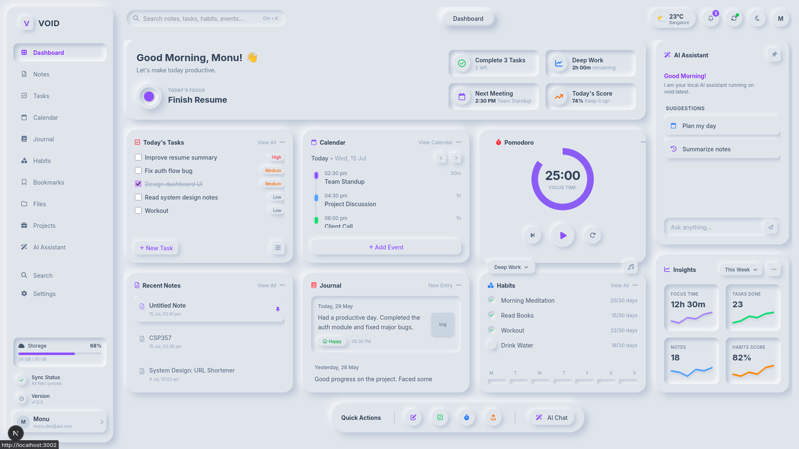
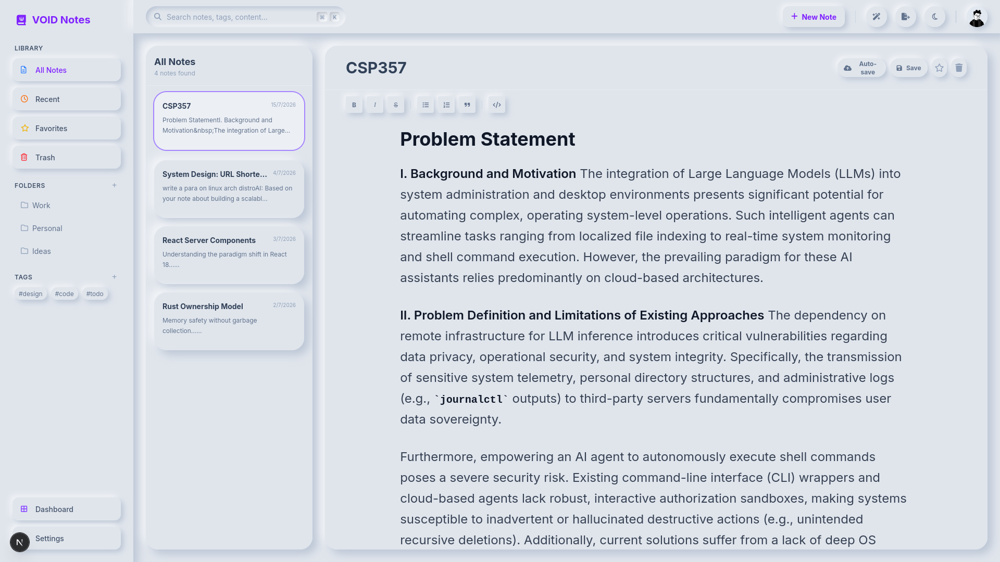

<div align="center">

# VOID

### *Build. Think. Remember.*

**One ecosystem. Zero context switching.**

Building a unified platform that combines productivity, knowledge management, software development, AI, and personal management into a single cohesive experience.

---

**Current Status:**  Active Development
**Architecture:** Turborepo • Next.js 15 • React 19 • Supabase • Tailwind CSS • AI-First

</div>

---

# Vision

As a developer, I've always found myself switching between dozens of applications just to get through a normal day.

* Notes in one app.
* Tasks in another.
* Calendar somewhere else.
* GitHub in the browser.
* Documentation scattered everywhere.
* AI tools completely disconnected from my workflow.

Every application solves one problem while creating another: **context switching**.

VOID is my attempt to solve this problem by building an ecosystem instead of another standalone application.

The goal is simple:

> **Everything an engineer needs. One login. One dashboard. One workflow.**

---

# What is VOID?

VOID is an AI-first productivity ecosystem designed specifically for software engineers, developers, students, creators, and technical professionals.

Instead of installing dozens of unrelated applications, VOID provides independent modules that work together through a shared backend, shared authentication, unified search, and a common AI layer.

```
                    VOID

                     One Login
                         │
        ┌────────────────┼────────────────┐
        │                │                │
   Dashboard         VOID AI          Settings
        │
──────────────────────────────────────────────────────

 Workspace
 Knowledge
 Development
 Career
 Finance
 Health
 Personal
 Automation
 Analytics
```

The dashboard isn't another homepage—it is the command center that answers one question:

> **"What should I work on right now?"**

---

## Preview

### Dashboard

<p align="center">
  
</p>

### Notes

<p align="center">
  
</p>

---

# Core Philosophy

I don't want VOID to become another "all-in-one" application where everything lives on one page.

Instead, every feature is developed as its own application while sharing the same backend and design system.

Think of it like:

* Google Workspace
* JetBrains Toolbox
* Adobe Creative Cloud

Independent applications.

One ecosystem.

---

# Planned Applications

## Workspace

* Dashboard
* Notes
* Tasks
* Calendar
* Goals
* Habits
* Journal

---

## Knowledge

* Markdown Notes
* Wiki
* Research
* Bookmarks
* Reading
* PDF Library

---

## Development

* GitHub Integration
* Project Management
* Code Snippets
* API Collections
* Deployment Tracking
* Server Monitoring

---

## Career

* Resume Builder
* ATS Checker
* Interview Preparation
* DSA Tracker
* Company Tracker
* Job Applications

---

## AI

Powered by **VOID**, the intelligence layer behind VOID.

Planned capabilities include:

* AI Chat
* Voice Assistant
* RAG
* Prompt Library
* Semantic Search
* Document Analysis
* Research Assistant
* Automation Agents

---

## Personal

* Finance
* Subscriptions
* Workout
* Sleep
* Water Tracker
* Reading
* Movies
* Wishlist

---

# Architecture

VOID is built as a scalable monorepo.

```
apps/
├── dashboard/
├── notes/
├── tasks/
├── calendar/
├── ai/
├── projects/
├── finance/
└── ...

packages/
├── ui/
├── supabase/
├── auth/
├── database/
├── types/
├── utils/
└── config/
```

Every application shares:

* Authentication
* Database
* Design System
* Components
* Types
* AI Services
* Storage
* Search
* Notifications

This architecture allows every module to evolve independently while maintaining a consistent user experience.

---

# Tech Stack

## Frontend

* Next.js 15
* React 19
* TypeScript
* Tailwind CSS

## Backend

* Supabase
* PostgreSQL
* Row Level Security
* Storage
* Realtime

## AI

* Ollama
* Vercel AI SDK
* pgvector
* Local LLMs
* VOID AI

## Editor

* Tiptap
* Markdown
* Rich Text

## Search (Planned)

* Meilisearch
* Typesense

---

# Development Roadmap

VOID is being developed in carefully planned phases.

## Phase 0 — Foundation 

* Authentication
* Database
* Shared UI
* Design System
* Routing

---

## Phase 1 — Dashboard 

* Central Dashboard
* Widgets
* Activity Feed
* Quick Actions
* Global Search

---

## Phase 2 — Notes 

* Rich Text Editor
* Markdown
* AI Assistance
* Attachments
* Backlinks
* Wiki Links

---

## Upcoming Phases

* Tasks
* Calendar
* Knowledge
* Development
* Career
* AI
* Personal
* Automation
* Analytics
* Desktop Companion

---

# Current Progress

## ✅ Completed

* Turborepo architecture
* Shared packages
* Next.js App Router
* Supabase authentication
* Database foundation
* Shared UI library
* Dashboard application
* Notes application
* AI SDK initialization

---

## 🚧 Currently Working On

* Dashboard UI
* Notes editor
* Rich text experience
* Shared services
* Storage integration
* Search architecture

---

# Why I'm Building This

This project started as a personal tool.

Over time, it evolved into something much bigger.

I wanted one place where I could:

* manage projects
* write notes
* organize research
* build software
* prepare for interviews
* track learning
* use AI
* automate repetitive work

without constantly switching between applications.

VOID is my long-term attempt to build that environment.

---

# Future Vision

My long-term goal is for VOID to become an extensible platform rather than a fixed application.

Future plans include:

* Desktop application
* Mobile applications
* Plugin ecosystem
* Team workspaces
* Real-time collaboration
* Self-hosted deployment
* Cloud synchronization
* AI agents powered by VOID

---

# Running Locally

```bash
git clone https://github.com/<username>/engineer-os.git

cd engineer-os

npm install

npm run dev
```

Current development ports:

| Application | Port |
| ----------- | ---- |
| Dashboard   | 3001 |
| Notes       | 3002 |

---

# Project Status

VOID is under active development.

The architecture has been established, and the foundation is in place. Development is currently focused on the Dashboard and Notes applications before expanding into the rest of the ecosystem.

---

# Contributing

Although VOID started as a personal project, I welcome discussions, ideas, issue reports, and contributions that align with the long-term vision.

If you'd like to contribute, feel free to open an issue or submit a pull request.

---

# License

Licensed under the **GPLv3 License**.

---

<div align="center">

### Building the operating system I always wanted as an engineer.

If you find this project interesting, consider giving it a star.

</div>
